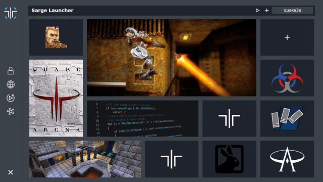

# Sarge Launcher


Sarge Launcher is a cross platform utility for Quake 3 Arena and Q3A mods

It provides some useful features like a
quick server browser, unlimited demo/level browsing, and Q3A client management among other things.

## Development setup

### install all [Tauri v2](https://v2.tauri.app/start/prerequisites/) prerequisites for your system

### Install node_modules using nodejs lts/iron (v20.19.2)
```
npm install
```

### Compiles and hot-reloads for development from ./src-tauri
```
cargo tauri dev
```

### Compiles and minifies for production ./src-tauri
```
cargo tauri build
```


